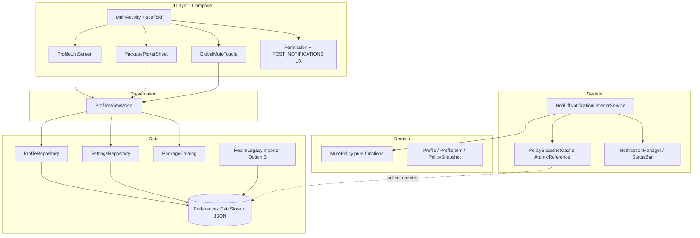
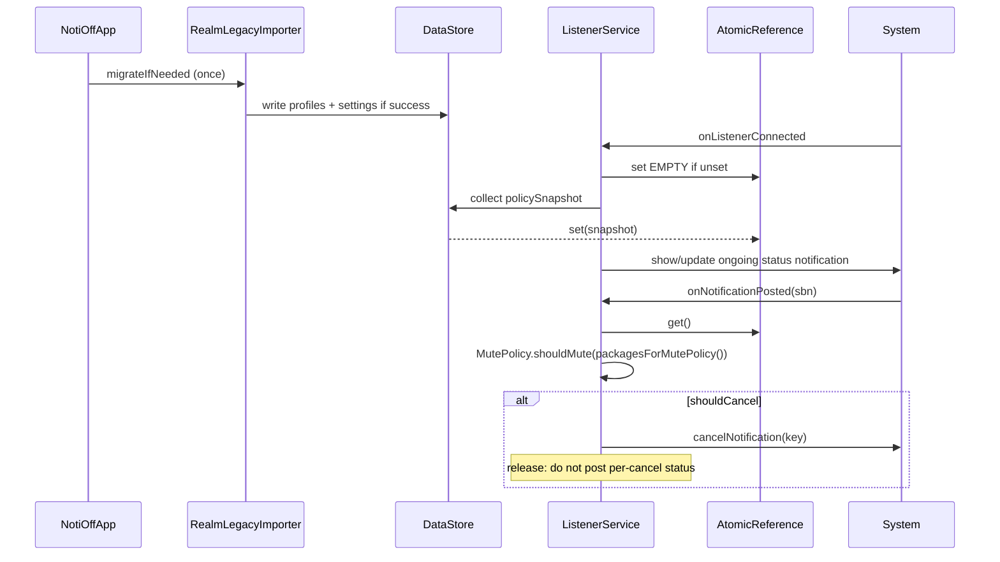
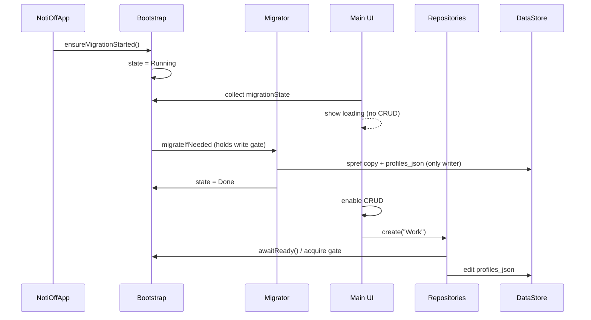
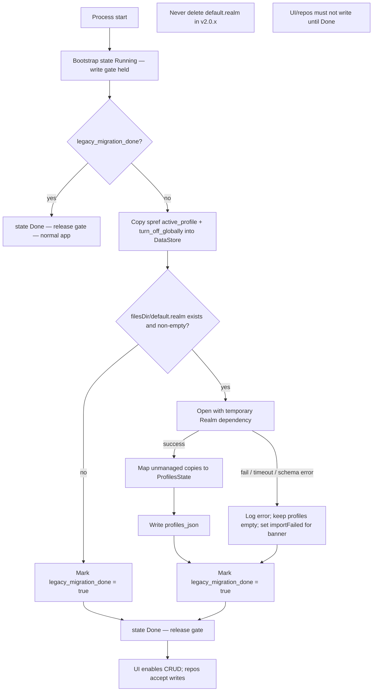
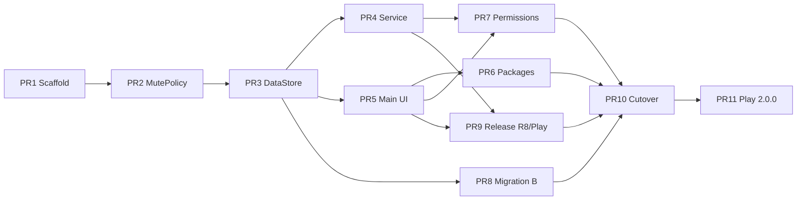

# NotiOff Android Modernization — Rebuild Design Document

| Field | Value |
|-------|--------|
| **Title** | Rebuild NotiOff Android App (Modernization Plan) |
| **Author** | TBD |
| **Date** | 2026-07-03 |
| **Status** | Draft (revision 3 — migration race gate + residual polish) |
| **Application ID** | `com.ilusons.notioff` (preserve for Play continuity) |
| **Gradle `namespace`** | `com.ilusons.notioff` (AGP 8; separate from applicationId, same value) |
| **Current version** | `1.0.8` / `versionCode` `100000008` (from `src/gradle.properties`) |
| **Target first modern release** | `versionName` **2.0.0** / `versionCode` **100000009** |
| **Repo layout today** | Workspace root; Android project nested under `src/` |

---

## Overview

NotiOff is a small utility that silences notifications via a `NotificationListenerService`, using named **profiles** (lists of app packages) and a **global mute** flag. The current codebase cannot be responsibly maintained or shipped: AGP `3.4.2`, Gradle `5.6.2`, Support Library (not AndroidX), `compileSdk`/`targetSdk` **28**, dead `jcenter()` repositories, Realm `5.11.0` with data-lossy migration (`deleteRealmIfMigrationNeeded()`), broken/misconfigured manifest intent-filters on the listener service, and notifications posted without channels.

This document defines a **practical stack modernization and app-module rewrite** that preserves product behavior and Play listing continuity (`applicationId` / signing), while replacing the obsolete build system, UI toolkit, storage layer, service patterns, CI, and publishing tooling. It is **not** a product redesign: feature parity is the default; intentional behavior changes are called out explicitly (notably removal of the blank full-screen-intent “hack” for high-priority notifications, fixed NPE when no active profile, and quieter status-notification UX).

---

## Background & Motivation

### Current state (verified in tree)

| Area | Fact (path / detail) |
|------|----------------------|
| Root build | `src/build.gradle` — AGP `3.4.2`, Realm plugin `5.11.0`, Play Publisher `2.2.1`, `jcenter()` |
| App module | `src/app/build.gradle` — `compileSdkVersion 28`, `minSdkVersion 23`, `targetSdkVersion 28`, Support libs `28.0.0`, `multiDexEnabled`, signing from `safe/keys.properties` + `safe/keystore.jks` |
| Gradle wrapper | `src/gradle/wrapper/gradle-wrapper.properties` — Gradle **5.6.2** |
| Versioning | `src/gradle.properties` — `version=1.0.8`, `versionCode=100000008` |
| Release automation | root `.releaserc` — `gradle-semantic-release-plugin` with `"pd": "./src"`, task `app:publishReleaseApk`, commits `./src/gradle.properties` |
| Source | Java only under `src/app/src/main/java/com/ilusons/notioff/` (~8 classes; `SplashActivity` **not** in manifest) |
| Storage | Realm (`Profile`, `ProfileItem`) + SharedPreferences (`spref`: `active_profile`, `turn_off_globally`) |
| Listener | `Service.java` extends `NotificationListenerService` |
| UI | `MainActivity.java` (Drawer + RecyclerView + FAB), `PackagesDialog.java` |
| Manifest issues | `AndroidManifest.xml` — service has incorrect action/`MAIN`/`LAUNCHER` filters; `exported="false"` with wrong binding pattern; no `Application` class; no `POST_NOTIFICATIONS` |
| Play listing | `src/app/src/main/play/listings/en-US/full-description.txt` claims “no extra permissions needed” (misleading under modern model) |
| CI | `.github/workflows/android-ci.yml` (`checkout@v1`, custom action); `.gitlab-ci.yml` (gpg `git secret reveal`, semantic-release) |

### Pain points

1. **Does not build on modern toolchains** without heroic dependency/repo archaeology (`jcenter` is gone; AGP 3.x is unsupported).
2. **Cannot meet Play target API requirements** with `targetSdk 28`.
3. **Security / platform debt**: no notification channels (required since API 26), misuse of `PendingIntent` flags (value `0`), full-screen intent without policy compliance, Support Library, obsolete ProGuard keep rules for ActionBarSherlock/Parse/etc., missing `POST_NOTIFICATIONS` for target 33+.
4. **Data integrity**: `RealmEx.init` uses `deleteRealmIfMigrationNeeded()` — any schema change wipes user profiles.
5. **Architecture**: business logic embedded in Activity/Dialog/RealmObject static methods and the Service; hard to test mute decision logic in isolation.
6. **Package visibility / Play policy**: `PackagesDialog` uses `getInstalledApplications(GET_META_DATA)` then filters by launch intent — will need modern package-visibility handling.
7. **Latent crash**: when global is off and no active profile, `Service.onNotificationPosted` can NPE on `profile.getItems()` after a catch that only logs (`Service.java` ~72–81 then ~81).

### Core product behavior to preserve

1. **Profiles** — named lists of packages to silence.
2. **Activate a profile** — only packages in the active profile are cancelled (when global is off).
3. **Global turn-off** — silence all clearable, non-ongoing notifications (except own app).
4. **NotificationListenerService** — observe posts and cancel.
5. **UI** — main screen with profile list, create profile, package multi-select, drawer nav (help / contact / exit / create), global on/off toggle.
6. **Permission flow** — guide user to enable Notification Listener access.

---

## Goals & Non-Goals

### Goals

- Ship a maintainable app that builds with current AGP/Gradle and targets current Play API levels.
- Preserve `applicationId` `com.ilusons.notioff` and existing signing key continuity for updates.
- Preserve user-visible feature set (profiles, active profile, global mute, listener mute rules).
- Replace Realm with Preferences DataStore + JSON; **best-effort one-time import** of existing profiles (Option B, locked — see K13).
- Use Kotlin, modern Android architecture (UI → ViewModel → Repository → storage), Coroutines/Flow.
- Correct manifest (namespace, exported components, queries, permissions including `POST_NOTIFICATIONS`), notification channels, PendingIntent mutability, and listener service declaration.
- Update CI (GitHub Actions primary; archive GitLab in cutover), Play publisher, secret handling, and store compliance artifacts.
- Provide a phased PR plan an engineer can execute without re-designing mid-flight.

### Non-Goals

- Redesigning product features, adding cloud sync, accounts, analytics productization, or multi-device profiles.
- Supporting API levels below `minSdk` **26**.
- Keeping Java, Support Library, Realm (except temporary migrator dependency), jcenter, or the nested `src/`-as-root layout long-term.
- Preserving the blank full-screen-intent notification hack.
- Preserving dead code paths (`IOEx` bulk utilities unused by core mute flow; ActionBarSherlock ProGuard rules; Picasso).
- Greenfield product marketing rebrand or new package name.
- Cancelling **already-posted** notifications when a profile is activated (legacy does not; v2.0 parity — optional later enhancement).

---

## Key Decisions

| # | Decision | Rationale |
|---|----------|-----------|
| K1 | **Clean rewrite of the app module** on a modern stack; do **not** incrementally AndroidX-migrate the 2019 Java/Realm tree | Surface area is ~8 Java classes / ~1.7k LOC including dead code; incremental migration costs more than rewriting with parity tests. Preserve package name only. |
| K2 | **Kotlin + Jetpack Compose + Material 3** for UI | UI is list + dialogs + drawer + toggles — ideal Compose size. Avoid dual XML/Compose maintenance. |
| K3 | **AGP 8.9+ / Gradle 8.11+**, `compileSdk`/`targetSdk` **35** (raise to **36** only if Play requires at ship time), `minSdk` **26** | Channels always present; drops pre-O multiDex noise; aligns with mid-2026 Play requirements. MultiDex generally unnecessary. |
| K4 | **Preferences DataStore + kotlinx.serialization JSON only** (not Proto DataStore, not Room) for profiles/settings | Tiny data; single JSON blob + preference keys; Flow-friendly; Proto kept only as rejected alternative. |
| K5 | **Layered architecture**: Compose UI → ViewModel → Repository → DataStore; pure `MutePolicy` for cancel decisions | Testable mute logic without Android; service and UI share repository. |
| K6 | **Gradle Kotlin DSL** at modern repo root (`/app`, not long-term `/src/app`) | Industry default; type-safe accessors; better IDE support. |
| K7 | **Remove blank full-screen `notifyBlank()` / `cancelBlank()` hack** | Violates modern full-screen intent expectations; abuse-prone; `cancelNotification(key)` is the supported API. |
| K8 | **Package listing via launcher-intent query + `<queries>`**, avoid `QUERY_ALL_PACKAGES` | Matches old effective behavior (launchable apps only) while complying with package visibility. |
| K9 | **Same `applicationId` `com.ilusons.notioff` and AGP `namespace` `com.ilusons.notioff`** | Play update continuity; AGP 8 requires namespace independent of manifest `package`. |
| K10 | **Rename listener class to `NotiOffNotificationListenerService`** | Old class name `Service` is ambiguous; fix intent-filter to correct `NotificationListenerService` action only. |
| K11 | **GitHub Actions as sole primary CI**; **archive/remove GitLab CI in PR 10** | One modern pipeline; current GH workflow is stale (`checkout@v1`). |
| K12 | **`versionName` 2.0.0 / `versionCode` 100000009** for first modern ship; thereafter **manual** monotonic bumps in root `gradle.properties` (retire semantic-release path coupling to `./src`) | Least surprise vs existing Play track (`100000008` + 1). Major name signals stack/storage break. Drop `.releaserc` `pd: ./src` automation or rewrite it only after cutover if reintroduced. |
| K13 | **Migration Option B locked**: best-effort one-time Realm + `spref` import on first v2 launch; hard time-box; fall through to empty state on failure; **never delete `default.realm` in v2.0.x**; **single-flight gate** so migration completes before any user/repository writes (see K22) | Best UX without requiring an unbuildable 1.x bridge release (Option C likely infeasible due to jcenter). User-base unknown → B with automatic fall-through. See Migration specification. |
| K22 | **Bootstrap single-flight**: expose `MigrationState` (`NotStarted`/`Running`/`Done`); success **and** soft-fail both end in `Done` (optional `importFailed` flag for banner); repositories suspend mutating writes until `Done`; UI shows brief non-interactive loading until ready; **no** `runBlocking` on main | Prevents first-launch races where UI `create`/settings overwrite migrator `replaceAll`/`spref` copy (or vice versa). |
| K14 | **Status notification UX**: one ongoing **low-importance** “NotiOff is active …” notification; update label when mode/profile changes; **no per-cancel “Silenced pkg…” in release**; debug builds may log cancels | Stops spam from legacy `notify` on every cancel; still surfaces that the app is working; reduces `POST_NOTIFICATIONS` noise. |
| K15 | **Theme: follow system light/dark** (Material 3 dynamic where appropriate) | Legacy forced `MODE_NIGHT_NO`; system-following is modern default and avoids theme churn in PR 5. |
| K16 | **Manual DI via `NotiOffApp` + `AppContainer`** (no Hilt in v2.0) | App is tiny; Hilt overhead not justified. Revisit only if module count grows. |
| K17 | **Listener component rebind (`toggleNotificationListenerService`) is secondary**, not default on every launch | Legacy disabled/enabled the component after 5s in `checkRequirements`. Default v2 path: detect access → settings deep-link only. Offer rebind as explicit “Troubleshoot connection” action in help/permission UI for OEM flakiness. |
| K18 | **Do not cancel already-posted notifications on profile activate / global toggle** | Legacy only acts in `onNotificationPosted`. Call out as intentional parity (stretch goal for a later release if users request). |
| K19 | **`POST_NOTIFICATIONS` declared + runtime request** for status UI only; mute via `cancelNotification` works without it | Required for targetSdk 33+ own notifications; denial is degraded status UI only. |
| K20 | **Backup: `allowBackup=true` with modern `dataExtractionRules` / `fullBackupContent`** including DataStore; **exclude** `*.realm` from backup | Restores user profiles; avoids re-importing stale realm after restore. |
| K21 | **Play compliance artifacts required for 2.0 ship**: updated en-US listing (remove “no extra permissions”), Data safety form answers, privacy policy URL, NLS declaration text | Listing today is inaccurate; notification-access apps face Console scrutiny. |

---

## Proposed Design

### Strategy: greenfield app module rewrite (recommended)

**Recommendation:** treat the existing `src/` tree as a **reference implementation and behavior oracle**, not as the base for incremental patches. Create a modern Android project layout at **repo root**, reimplement features in Kotlin with parity tests, keep `com.ilusons.notioff`.

**Dual-tree rules (mandatory):**

- New root Gradle project is the **only** build CI runs after PR 1.
- **Do not** `include(":app")` pointing at old `src/app`, and **do not** add old tree as a second module (same `applicationId` would be disastrous).
- Legacy `src/` remains **inert reference files** (readable oracle) until PR 10 deletes/archives it; building legacy requires explicitly using `src/gradlew` locally only (unsupported, may not resolve deps).
- README “How to build” points **only** at the new root wrapper.

**Why not incremental migration?**

| Approach | Pros | Cons |
|----------|------|------|
| Incremental (AndroidX jetifier → AGP upgrades → replace Realm → Compose) | Feels safer; smaller early PRs | Each step fights dead deps; multi-week debt for ~1k LOC of logic; half-migrated risk |
| **Clean rewrite (chosen)** | Fastest path to green build; clean architecture; no jetifier | Need parity matrix + Option B importer; temporary dual-tree |

**Continuity guarantees:**

- `applicationId` / `namespace`: `com.ilusons.notioff`
- Same upload keystore (from secrets / `safe/`)
- Feature parity per matrix below
- Play listing assets under `app/src/main/play/` (migrate from `src/app/src/main/play/`)

### Target tech stack (mid-2026 concrete pins)

Pins are **recommended starting points**; lock exact versions at scaffolding time against current stable BOM.

| Layer | Choice |
|-------|--------|
| Language | Kotlin **2.1.x** (or current stable 2.x) |
| UI | Jetpack Compose (BOM), Material **3**, follow system dark/light (K15) |
| Architecture components | `lifecycle-viewmodel-compose`, `lifecycle-runtime-compose` |
| Async | Kotlin Coroutines + Flow |
| Storage | **`androidx.datastore:datastore-preferences` + `kotlinx-serialization-json` only** |
| DI | Manual `AppContainer` (K16) |
| AGP | **8.9.x+** with `namespace = "com.ilusons.notioff"` |
| Gradle | **8.11+** (wrapper) |
| JDK | **17** |
| compileSdk / targetSdk | **35** (36 only if Play requires at release) |
| minSdk | **26** |
| Testing | JUnit 4 or 5 + Truth; Turbine for Flow; AndroidX Test / Compose UI Test |
| Play upload | `com.github.triplet.play` **3.x** |
| R8 | Minify on release; serialization + DataStore keep rules (see Release minify) |

**Explicitly remove (long-term):** Realm (except temporary migrator in PR 8), Support Library, `com.anthonycr.grant:permissions`, swipe-layout/recyclerview-animators, Picasso, multiDex (unless measured need).

### Modern project structure

```text
/   (repo root — new Gradle root; sole CI build)
  settings.gradle.kts          # include(":app") only — never legacy src/app
  build.gradle.kts
  gradle.properties            # version=2.0.0, versionCode=100000009
  gradle/wrapper/
  app/
    build.gradle.kts           # namespace, sdk, compose, serialization plugin
    proguard-rules.pro
    src/main/
      AndroidManifest.xml
      kotlin/com/ilusons/notioff/
        NotiOffApp.kt
        MainActivity.kt
        di/AppContainer.kt
        ui/theme/ | main/ | packages/ | permission/ | components/
        service/
          NotiOffNotificationListenerService.kt
          NotificationChannels.kt
          PolicySnapshotCache.kt
        domain/model/ | MutePolicy.kt
        data/
          ProfileRepository.kt
          SettingsRepository.kt
          ProfilesJson.kt
          migration/RealmLegacyImporter.kt
        util/PackageCatalog.kt | NotificationAccess.kt | PermissionHelpers.kt
      res/
        xml/data_extraction_rules.xml
        xml/backup_rules.xml
      play/                    # migrated listings + contact
    src/test/...
    src/androidTest/...
    src/testFixtures/ or app/src/test/resources/migration/
      default.realm            # checked-in 1.0.8 fixture if producible
      spref.xml                # sample active_profile / turn_off_globally
  .github/workflows/android-ci.yml
  safe/                        # encrypted secrets only
  src/                         # LEGACY inert reference until PR 10 (not in settings.gradle.kts)
  timeline/
  README.md
```

Package layout conventions are fixed in PR 1 so parallel PR 4/5 do not thrash paths.

### Essential Gradle (`app/build.gradle.kts` sketch)

```kotlin
plugins {
    id("com.android.application")
    id("org.jetbrains.kotlin.android")
    id("org.jetbrains.kotlin.plugin.compose")
    id("org.jetbrains.kotlin.plugin.serialization")
}

android {
    namespace = "com.ilusons.notioff"
    compileSdk = 35

    defaultConfig {
        applicationId = "com.ilusons.notioff"
        minSdk = 26
        targetSdk = 35
        versionCode = property("versionCode").toString().toInt()
        versionName = property("version").toString()
        testInstrumentationRunner = "androidx.test.runner.AndroidJUnitRunner"
    }

    buildFeatures { compose = true }
    // signingConfigs, buildTypes.release.isMinifyEnabled = true, proguard files...
}
```

### Complete target `AndroidManifest.xml` sketch

```xml
<?xml version="1.0" encoding="utf-8"?>
<manifest xmlns:android="http://schemas.android.com/apk/res/android">

    <!-- Own status notifications (API 33+). Mute via NLS does NOT require this. -->
    <uses-permission android:name="android.permission.POST_NOTIFICATIONS" />

    <queries>
        <intent>
            <action android:name="android.intent.action.MAIN" />
            <category android:name="android.intent.category.LAUNCHER" />
        </intent>
    </queries>

    <application
        android:name=".NotiOffApp"
        android:allowBackup="true"
        android:fullBackupContent="@xml/backup_rules"
        android:dataExtractionRules="@xml/data_extraction_rules"
        android:icon="@mipmap/ic_launcher"
        android:label="@string/app_name"
        android:roundIcon="@mipmap/ic_launcher_round"
        android:supportsRtl="true"
        android:theme="@style/Theme.NotiOff"
        android:enableOnBackInvokedCallback="true">

        <activity
            android:name=".MainActivity"
            android:exported="true"
            android:theme="@style/Theme.NotiOff"
            android:windowSoftInputMode="adjustResize">
            <intent-filter>
                <action android:name="android.intent.action.MAIN" />
                <category android:name="android.intent.category.LAUNCHER" />
            </intent-filter>
        </activity>

        <service
            android:name=".service.NotiOffNotificationListenerService"
            android:exported="true"
            android:permission="android.permission.BIND_NOTIFICATION_LISTENER_SERVICE"
            android:label="@string/app_name">
            <intent-filter>
                <action android:name="android.service.notification.NotificationListenerService" />
            </intent-filter>
        </service>
    </application>
</manifest>
```

**Backup rules intent:** include DataStore files under app files/preferences; **exclude** `*.realm` and legacy realm lock files so restores do not reintroduce unmigrated DB noise.

### Architecture



#### Layers

1. **UI (Compose)** — screens and dialogs only; no direct DataStore access.
2. **ViewModel** — `StateFlow<UiState>`; create/delete/activate profile, set packages, toggle global mute, permission status.
3. **Repository** — single write path; transactional delete clears dangling active key (see API).
4. **Domain `MutePolicy`** — pure Kotlin (below).
5. **Service cache** — `AtomicReference<PolicySnapshot>` updated from repository Flows.

#### Domain `MutePolicy`

```kotlin
data class MuteDecision(
    val shouldCancel: Boolean,
    val reason: String? = null,
)

object MutePolicy {
    fun shouldMute(
        packageName: String,
        isOngoing: Boolean,
        isClearable: Boolean,
        selfPackageName: String,
        globalMute: Boolean,
        activeProfilePackages: Set<String>?, // null == no active profile
    ): MuteDecision {
        if (packageName == selfPackageName) return MuteDecision(false, "self")
        if (isOngoing || !isClearable) return MuteDecision(false, "ongoing_or_uncleared")
        if (globalMute) return MuteDecision(true, "global")
        val packages = activeProfilePackages ?: return MuteDecision(false, "no_active_profile")
        // Exact match only (intentional vs legacy equalsIgnoreCase)
        return if (packageName in packages) MuteDecision(true, "profile")
        else MuteDecision(false, "not_in_profile")
    }
}
```

**Required unit tests (non-exhaustive):**

| Case | Expected |
|------|----------|
| global on, clearable | cancel, reason `global` |
| global off, active packages contain pkg | cancel, `profile` |
| global off, active packages empty set (active profile exists) | no cancel, `not_in_profile` |
| global off, `activeProfilePackages == null` | no cancel, `no_active_profile` — **also locks NPE fix** |
| ongoing / non-clearable / self | no cancel |
| package `Com.Example.App` vs stored `com.example.app` | **no cancel** (exact match; locks case-sensitivity change) |

#### PolicySnapshot mapping (service wiring — locked)

```kotlin
data class PolicySnapshot(
    val globalMute: Boolean = false,
    val activeProfileTitle: String? = null,
    /** Packages of the active profile only. Empty if title non-null but profile has no items.
     *  Ignored for mute when title is null — do NOT pass this set as “active packages” blindly. */
    val activePackages: Set<String> = emptySet(),
) {
    /** Correct argument for MutePolicy.activeProfilePackages */
    fun packagesForMutePolicy(): Set<String>? =
        activeProfileTitle?.let { activePackages }

    companion object {
        /** Safe default before first DataStore emission */
        val EMPTY = PolicySnapshot()
    }
}

// In listener:
val snap = cache.get() // AtomicReference
val decision = MutePolicy.shouldMute(
    packageName = sbn.packageName,
    isOngoing = sbn.isOngoing,
    isClearable = sbn.isClearable,
    selfPackageName = packageName,
    globalMute = snap.globalMute,
    activeProfilePackages = snap.packagesForMutePolicy(), // null when no active profile
)
```

**Repository combination rule:** when building `PolicySnapshot` from DataStore:

- If `active_profile` key is null/blank → `activeProfileTitle = null`, `activePackages = emptySet()` (mute path uses `null` via `packagesForMutePolicy()`).
- If title is set but profile missing (dangling legacy key) → treat as **no active profile** (`title` forced null for snapshot, or clear key on read — prefer **clear on read once** + log).
- If title set and profile found → `activePackages = profile.items.map { it.packageName }.toSet()` — **never** union of all profiles.

Unit tests must cover repository/snapshot combination, not only pure `MutePolicy`.

#### Process / threading / cache bootstrap (locked)

| Concern | Spec |
|---------|------|
| Process | Single app process; **never** set `android:process` on the listener |
| Default snapshot | `PolicySnapshot.EMPTY` (global off, no active profile) until first successful collection |
| Storage | `AtomicReference<PolicySnapshot>` (or equivalent lock-free read) for `onNotificationPosted` |
| Collection start | Prefer `onListenerConnected` (and also `onCreate` if connected ordering varies): launch coroutine on `SupervisorJob() + Dispatchers.Main.immediate` or a single-thread service scope |
| Updates | `repository.policySnapshot.collect { cache.set(it); refreshOngoingStatusNotification(it) }` |
| Cancellation | Cancel job in `onDestroy` and `onListenerDisconnected` |
| Thread safety | `onNotificationPosted` may not be the collector thread — **only** `cache.get()` on hot path; no DataStore read on hot path |
| Pre-existing notifications | **Do not** scan `activeNotifications` to cancel on profile activate / global on (K18). Only new posts. |
| DataStore after migration | Migration runs early in `Application.onCreate` before UI; service may start later and will observe migrated data |



### Feature modules (logical, single `app` module)

Physical multi-module is optional; **single module** preferred.

### UI design (behavior parity with modern UX)

| Old | New |
|-----|-----|
| `MainActivity` + `DrawerLayout` + `NavigationView` | `MainActivity` + Material 3 scaffold + `ModalNavigationDrawer` |
| Forced light (`MODE_NIGHT_NO`) | **Follow system** (K15) |
| `RecyclerView` profiles | `LazyColumn` profile cards |
| FAB create profile | FAB + drawer item |
| `AlertDialog` + `EditText` | Compose `AlertDialog` |
| `PackagesDialog` | Modal sheet / dialog + multi-select + **search** enhancement |
| Global toggle `all_status` | Top bar Switch / icon toggle |
| Help / Contact / Exit | Same; Exit → `finishAffinity()` not `killProcess` |
| `SplashActivity` (not in manifest) | Drop; optional Android 12+ splash API |
| Permission check delayed 5s + `getRunningServices` + auto rebind | On launch + `onResume`: listener access check; settings CTA; **no auto rebind** (K17); separate soft ask for `POST_NOTIFICATIONS` |

### NotificationListenerService (modern)

- Manifest as in complete sketch above.
- Channels created in `NotiOffApp.onCreate`:
  - **`notioff_status`** — `IMPORTANCE_LOW`, ongoing status only (K14).
- Ongoing status text examples:
  - Global on: `NotiOff active — silencing all`
  - Profile “Work”: `NotiOff active — Work`
  - Nothing active: `NotiOff idle — enable global or a profile` (or hide ongoing when fully idle — prefer still show low-priority idle so user can open app; product default: **show when listener connected**, text reflects mode).
- **Release:** never post “Silenced com.foo…” per cancel.
- **Debug:** optional log line with package + `MuteDecision.reason`.
- `PendingIntent`: `FLAG_IMMUTABLE` (or `FLAG_UPDATE_CURRENT or FLAG_IMMUTABLE`); content intent → `MainActivity`.
- No full-screen intents.

### Permissions matrix

| Permission / access | Why | If denied |
|---------------------|-----|-----------|
| Notification Listener (special access) | Core mute via `cancelNotification` | App cannot mute; persistent CTA to settings |
| `POST_NOTIFICATIONS` (runtime, API 33+) | Ongoing status notification only | Mute still works; no/limited status UI; explain in permission copy |
| `QUERY_ALL_PACKAGES` | **Not used** | N/A |
| Full-screen intent | **Not used** | N/A |

**Runtime UX order:**

1. Explain + deep-link **Notification Listener** (blocking for core value).
2. After listener granted (or in parallel on API 33+), request **`POST_NOTIFICATIONS`** with copy: “NotiOff shows a quiet status notification when active. Silencing still works if you deny.”

### Package catalog & Play visibility

Old effective behavior: launchable apps only (`getInstalledApplications` + `getLaunchIntentForPackage != null`).

**New:**

```kotlin
val intent = Intent(Intent.ACTION_MAIN).addCategory(Intent.CATEGORY_LAUNCHER)
val launchables = packageManager.queryIntentActivities(
    intent,
    PackageManager.ResolveInfoFlags.of(0),
)
```

Plus manifest `<queries>` as in complete sketch. **Avoid** `QUERY_ALL_PACKAGES`.

### Data model

```kotlin
@Serializable
data class ProfilesState(
    val schemaVersion: Int = 1,
    val profiles: List<Profile> = emptyList(),
)

@Serializable
data class Profile(
    val title: String,
    val items: List<ProfileItem> = emptyList(),
)

@Serializable
data class ProfileItem(
    val packageName: String,
    val title: String,
)
```

**Storage layout (Preferences DataStore — locked):**

| Key | Type | Notes |
|-----|------|-------|
| `profiles_json` | String | Serialized `ProfilesState` via kotlinx.serialization |
| `active_profile` | String? | Profile title or absent |
| `turn_off_globally` | Boolean | Default false |
| `legacy_migration_done` | Boolean | Gate one-time Option B import |

### Mute behavior parity matrix

| Behavior | Old | New | Notes |
|----------|-----|-----|-------|
| Cancel clearable non-ongoing | Yes | Yes | Core |
| Skip ongoing / non-clearable / self | Yes | Yes | |
| Global mute all eligible | Yes | Yes | → DataStore |
| Active profile package match | `equalsIgnoreCase` | **Exact** package match | Unit test mixed-case |
| No active profile + global off | Intended no cancel; **legacy can NPE** | No cancel, **no crash** | Regression test (Issue 17) |
| Active profile with **empty** package list | No cancel | No cancel (`not_in_profile`) | Distinct from null active |
| High-priority blank FSI flash | Yes | **Removed** | K7 |
| Status on start / mode change | Frequent spam | **One ongoing low-importance** | K14 |
| Status on every silence | Yes | **No (release)** | K14 |
| Cancel already-shown notifications on activate | No | **No** | K18 |
| Profiles CRUD | Yes (weak title validation) | Yes — **trim; reject blank/duplicate; max 64** | Locked create rules |
| Delete active profile | Removes realm object; **dangling** `active_profile` key possible | **Transactional clear active if titles match** | Fix latent bug |
| First-launch migration vs UI writes | N/A (sync Realm on UI thread often) | **Single-flight gate; UI waits on MigrationState** | K22 — no lost updates |
| Activate / deactivate toggle | Yes | Yes | |
| Package multi-select | Yes | Yes + search | |
| Drawer help / contact | Yes | Yes (`notioff@ilusons.com`) | |
| Exit | `killProcess` | `finishAffinity()` | |
| “Force restart for full update” | Toast after edit | **Removed** — cache updates via Flow | |
| Listener “running” check | `getRunningServices` | Access-granted APIs | |
| Component rebind every launch | Yes (toggle enable) | **Manual troubleshoot only** | K17 |
| multiDex | On | Off unless needed | minSdk 26 |
| `POST_NOTIFICATIONS` | N/A (target 28) | Declare + request | K19 |

### Application class & init + migration single-flight gate (K22)

Migration must **not** be an unguarded fire-and-forget write that races the UI.

```kotlin
sealed class MigrationState {
    data object NotStarted : MigrationState()
    data object Running : MigrationState()
    /** Ready for normal reads/writes. FailedSoft still allows app use (empty or partial import). */
    data object Done : MigrationState()
}

interface Bootstrap {
    val migrationState: StateFlow<MigrationState>
    /** Single-flight: concurrent callers share one job; idempotent when already Done. */
    fun ensureMigrationStarted()
    suspend fun awaitReady() // suspends until Done (never blocks main via runBlocking)
}

class NotiOffApp : Application() {
    lateinit var container: AppContainer
        private set

    private val applicationScope =
        CoroutineScope(SupervisorJob() + Dispatchers.Default)

    override fun onCreate() {
        super.onCreate()
        NotificationChannels.ensureCreated(this)
        container = DefaultAppContainer(this, applicationScope)
        // Start single-flight bootstrap only — writers wait on MigrationState
        container.bootstrap.ensureMigrationStarted()
    }
}
```

**Gate rules (locked):**

| Rule | Spec |
|------|------|
| **Single-flight** | `ensureMigrationStarted()` launches at most one migrator job (`Mutex` or `AtomicReference<Job>`). Re-entry is a no-op while `Running` or after `Done`. |
| **State machine** | `NotStarted` → `Running` → `Done` (success **or** soft-fail both end in `Done` so the app is usable; optional `importFailed: Boolean` flag for banner). |
| **Who may write DataStore during bootstrap** | **Only** `LegacyMigration` / bootstrap code path. |
| **Repository mutations** | `create` / `delete` / `setItems` / `replaceAll` (from UI) / `setActiveProfileTitle` / `setGlobalMute` must `awaitReady()` (or `mutex.withLock` shared with migrator) **before** editing DataStore. Prefer shared `BootstrapWriteGate` mutex: migrator holds it for the whole import; UI writers acquire after. |
| **Reads during bootstrap** | Flows may emit defaults/EMPTY; UI must not present CRUD controls until `migrationState == Done`. |
| **UI** | `MainActivity` / root Compose: if state is `NotStarted` or `Running`, show brief non-interactive loading (“Setting up NotiOff…”). **Do not** use `runBlocking` on the main thread. After `Done`, enable FAB/drawer create and toggles. Listener service may collect policy snapshots throughout (defaults safe: global off, no active profile). |
| **Listener** | No user write path; may observe DataStore. Mute decisions use cache (EMPTY until data arrives)—correct and safe during migration. |
| **Already migrated installs** | If `legacy_migration_done == true`, bootstrap sets `Done` immediately (no load spinner beyond one frame). |



**Required test:** fake slow migrator (delay 200–500ms) concurrent with `create("A")` from a test coroutine started at `Running` — after both complete, profiles must contain migrated data **and** `"A"` **or** (if create was correctly blocked until Done) only migrated data then a post-Done `create("A")` succeeds without being overwritten. Preferred assertion: **UI/repo create suspended until Done, then applied once; final DataStore is not clobbered by late migrator write.**

---

## API / Interface Changes

No public HTTP API. Internal interfaces:

```kotlin
class InvalidProfileTitleException(message: String) : Exception(message)
class DuplicateProfileTitleException(message: String) : Exception(message)

interface ProfileRepository {
    val profiles: Flow<List<Profile>>

    /**
     * Creates a profile.
     * - Trims [title]; blank after trim → InvalidProfileTitleException (UI shows error).
     * - Duplicate title (case-sensitive match on stored title) → DuplicateProfileTitleException.
     * - Optional max length 64; over → InvalidProfileTitleException.
     * - Suspends until bootstrap MigrationState is Done (K22), then writes.
     */
    suspend fun create(title: String): Profile

    /** Deletes profile; if it was active, clears activeProfileTitle in the same transaction.
     *  Suspends until bootstrap Ready (K22). */
    suspend fun delete(title: String)
    suspend fun setItems(title: String, items: List<ProfileItem>)
    /** Migration-only / bootstrap path; not for UI. */
    suspend fun replaceAll(profiles: List<Profile>)
}

interface SettingsRepository {
    val activeProfileTitle: Flow<String?>
    val globalMute: Flow<Boolean>
    /** Emits combined PolicySnapshot with mapping rules above. */
    val policySnapshot: Flow<PolicySnapshot>

    /** All setters suspend until bootstrap Ready (K22). */
    suspend fun setActiveProfileTitle(title: String?)
    suspend fun setGlobalMute(enabled: Boolean)
}

interface LegacyMigration {
    /**
     * Idempotent via legacy_migration_done. Never deletes realm files.
     * Must be the sole DataStore writer while MigrationState is Running.
     */
    suspend fun migrateIfNeeded()
}

interface Bootstrap {
    val migrationState: StateFlow<MigrationState>
    fun ensureMigrationStarted()
    suspend fun awaitReady()
}
```

**Create validation (locked):**

| Input | Result |
|-------|--------|
| `"  Work  "` | Store title `"Work"` |
| `""` / `"   "` | Reject — UI error “Name required” |
| Existing `"Work"` again | Reject — UI error “Profile already exists” |
| Length > **64** | Reject — UI error “Name too long” |
| Title uniqueness | Exact string match after trim (case-sensitive; matches Realm PK equality on `Title`) |

**Delete semantics (locked):**

```text
delete(title):
  await bootstrap Ready
  read profiles + active
  remove profile where profile.title == title
  if active == title → active = null
  write both keys atomically (single DataStore.edit block)
```

Unit tests: delete active profile → `packagesForMutePolicy()` null; create blank/duplicate rejected; concurrent create during slow migration not lost/clobbered (K22).

---

## Data Model Changes

### From

- Realm: `Profile` (PK field `Title`, `RealmList` field `Items`), `ProfileItem` (PK field `Package`, field `Title`) — Java public fields as in source.
- SharedPreferences file name **`spref`** (mode private):
  - `active_profile` (String)
  - `turn_off_globally` (Boolean)
- Default Realm file path: **`context.filesDir/default.realm`** (Realm Java default name with default config — no custom name in `RealmEx`).

### To

- Preferences DataStore keys above; JSON `ProfilesState` with `schemaVersion`.

### Migration strategy — **Option B locked (K13)**



#### Option B implementation specification

| Item | Spec |
|------|------|
| **Trigger** | First process start where `legacy_migration_done != true` |
| **Write gate** | **K22**: migrator is sole writer until `MigrationState.Done`; UI/repos `awaitReady()` before mutations |
| **Time-box** | Soft: async under bootstrap (loading UI); hard: if Realm open/read throws or exceeds ~5s, abort to empty profiles (settings from `spref` still applied), still transition to `Done` |
| **Realm dependency** | Temporary Java Realm aligned to open legacy 5.11 files if possible. **Spike required in PR 8** (see spike note deliverable). Trial order: (1) attempt open of fixture/`default.realm` with a chosen pin, (2) if incompatible try last known 5.x line that builds under AGP 8, (3) if still fail → soft path only (empty profiles + `spref` + banner). Prefer schema classes matching legacy field names as migrator-only models. |
| **PR 8 spike note (mandatory)** | Commit a short `docs/migration-realm-spike.md` (or PR description section) stating: library coordinates tried, whether fixture or device `default.realm` opened, exception if any, and final strategy (“open works with X” **or** “open failed → soft path only”). Prevents rediscovery after merge. Soft-fail remains acceptable ship path. |
| **Schema classes (migrator-only)** | Mirror legacy: `Title` PK on Profile; `Items` list of ProfileItem; `Package` PK + `Title` on ProfileItem. **Do not** call `deleteRealmIfMigrationNeeded()` (that API enables wipe-on-migration when present; there is no `false` overload — simply **omit** it). Open with schema matching legacy fields only; **do not** run in-place schema migrations. On `RealmMigrationNeededException` or any open failure → **soft-fail** (empty profiles, mark done, banner). |
| **File path** | `File(context.filesDir, "default.realm")` |
| **Mapping** | For each Realm `Profile`: `Profile(title = realmProfile.Title, items = realmProfile.Items.map { ProfileItem(packageName = it.Package, title = it.Title ?: it.Package) })`. Use **unmanaged copies** (`copyFromRealm`) before closing instance. |
| **`spref` copy** | `context.getSharedPreferences("spref", MODE_PRIVATE)` → DataStore `active_profile`, `turn_off_globally` regardless of Realm success — still under write gate before any UI writes |
| **Active key validation** | After import, if `active_profile` not in imported titles, clear active |
| **Failure UX** | One-time in-app banner after `Done`: “Couldn’t import old profiles; create a new profile.” Not a crash. |
| **Realm file retention** | **Code must never call `realm.deleteRealm` / file delete on `default.realm` in v2.0.x** (K13). Optional cleanup only in a later **2.1+** after Play metrics show migration success. |
| **Fixtures (PR 8)** | Check in under test resources if producible: a minimal `default.realm` from a instrumented generator script run once on an emulator with old schema, plus sample `spref` XML. If realm binary cannot be generated in CI, use a **fake migrator seam** (`LegacyRealmReader` interface) with a real implementation + fake for unit tests, and one manual QA upgrade path from installed 1.0.8 APK. |
| **Option A** | Demoted to appendix only — not on critical path. |
| **Option C** | Demoted: would require shipping another 1.x from **unbuildable** AGP 3.4.2/jcenter tree (mirror repos, dependency archaeology). **Not planned** unless Option B fails in field and product mandates; then a minimal patch branch with Google Maven–only substitutes — not a casual two-release path. |

**Appendix — Option A (not default):** skip Realm read; set `legacy_migration_done=true` after copying `spref` only; release notes “please recreate profiles.”

#### Backup rules XML examples (K20 / PR 1)

DataStore Preferences files live under the app’s `files/datastore/` directory. Exclude legacy Realm files from backup/restore.

`res/xml/backup_rules.xml` (API ≤30 `fullBackupContent`):

```xml
<?xml version="1.0" encoding="utf-8"?>
<full-backup-content>
    <!-- Include DataStore (preferences + any future proto files under datastore/) -->
    <include domain="file" path="datastore/" />
    <!-- Exclude legacy Realm and journal/lock siblings -->
    <exclude domain="file" path="default.realm" />
    <exclude domain="file" path="default.realm.lock" />
    <exclude domain="file" path="default.realm.management" />
    <!-- Do not back up legacy spref exclusively if empty after migration; optional include: -->
    <!-- <include domain="sharedpref" path="spref.xml" /> -->
</full-backup-content>
```

`res/xml/data_extraction_rules.xml` (API 31+):

```xml
<?xml version="1.0" encoding="utf-8"?>
<data-extraction-rules>
    <cloud-backup>
        <include domain="file" path="datastore/" />
        <exclude domain="file" path="default.realm" />
        <exclude domain="file" path="default.realm.lock" />
        <exclude domain="file" path="default.realm.management" />
    </cloud-backup>
    <device-transfer>
        <include domain="file" path="datastore/" />
        <exclude domain="file" path="default.realm" />
        <exclude domain="file" path="default.realm.lock" />
        <exclude domain="file" path="default.realm.management" />
    </device-transfer>
</data-extraction-rules>
```

PR 1 should land these stubs (even before migration exists) so restore behavior is defined from day one.

---

## Alternatives Considered

### 1) Incremental modernization of existing Java app

- **Pros:** Diffs against known files.
- **Cons:** AGP 3→8 multi-hop; Realm/Support pain. **Rejected** (K1).

### 2) Room instead of DataStore JSON

- **Pros:** Structured queries.
- **Cons:** Overkill. **Rejected** as default (acceptable if team standard changes later).

### 3) Proto DataStore instead of Preferences + JSON

- **Pros:** Typed, less reflection surface.
- **Cons:** Extra protoc/schema tooling for a single blob; Preferences+JSON sufficient with explicit R8 rules. **Rejected** as default (K4).

### 4) XML Views + ViewBinding instead of Compose

- **Pros:** Closer to old layouts.
- **Cons:** More boilerplate; Compose default for new apps. **Rejected**.

### 5) Retain Realm as primary store

- **Rejected** for primary store; temporary migrator only (K13).

### 6) Separate listener process

- **Rejected** (DataStore multi-process issues).

### 7) Option C last-1.x JSON export bridge

- Technically cleanest migration file format, but **likely infeasible without archaeology**: current tree depends on `jcenter()` and AGP 3.4.2. Choosing C implies a dedicated “revive build” project (repo mirrors, dependency substitutions), not a quick second release. **Not selected.**

---

## Security & Privacy Considerations

| Topic | Guidance |
|-------|----------|
| **Notification access** | High privilege. In-app rationale before settings deep-link. Never exfiltrate or log notification content in release. |
| **Mute implementation** | Only `cancelNotification(key)` from package + flags; no payload storage. |
| **`POST_NOTIFICATIONS`** | Own status UI only; denial ≠ mute failure (K19). |
| **Package list** | Local only; launcher `<queries>` only. |
| **Full-screen intents** | Not used (K7). |
| **PendingIntent** | `FLAG_IMMUTABLE`. |
| **Signing secrets** | Prefer CI-stored secrets; never commit raw keystore/JSON. |
| **Backup** | K20 — encrypt via platform; exclude realm. |
| **Play policy** | NLS apps scrutinized; minimal permissions; accurate listing (K21). |
| **Exported components** | Launcher activity `exported=true`; NLS `exported=true` + bind permission; nothing else exported. |
| **R8** | See minify section. |

### Play Console / store deliverables (K21 — ship blockers for PR 11)

| Deliverable | Content direction |
|-------------|-------------------|
| **en-US full/short description** | Remove “no extra permissions needed.” State that NotiOff uses **Notification access** to cancel notifications the user chooses to silence, and may use the **notifications** permission for a quiet status indicator. |
| **Data safety form** | No data shared with third parties; no collection of notification contents; local-only profile/package lists; notification access purpose = core app functionality. |
| **Privacy policy URL** | Host a short policy (GitHub Pages or site): what access is used, no sale of data, contact `notioff@ilusons.com`. Required operationally for NLS apps in practice. |
| **Sensitive / NLS declaration** | Console declaration text matching actual behavior (cancel clearable notifications per profile/global). |
| **Graphics** | Reuse existing feature graphic/screenshots where still accurate; refresh if UI diverges heavily. |

### Threat model (brief)

| Threat | Severity | Mitigation |
|--------|----------|------------|
| Malicious bind to listener | High (platform) | `BIND_NOTIFICATION_LISTENER_SERVICE` |
| Cancel ongoing calls/media | Medium | Skip ongoing/non-clearable |
| Data wipe on upgrade | Medium | Option B + never wipe DataStore; no `deleteRealmIfMigrationNeeded` on primary store |
| Secret leakage in CI | High | Masked secrets; official actions |
| Policy rejection | High | No QUERY_ALL_PACKAGES / FSI; honest listing |
| R8 strips serializers | Medium | Keep rules + release smoke test |

---

## Release minify / R8 / serialization (locked expectations)

Release `isMinifyEnabled = true`.

**`proguard-rules.pro` must include (or rely on upstream consumer proguards where sufficient):**

```proguard
# kotlinx.serialization — keep generated serializers for app models
-keepattributes *Annotation*, InnerClasses
-dontnote kotlinx.serialization.AnnotationsKt
-keep,includedescriptorclasses class com.ilusons.notioff.**$$serializer { *; }
-keepclassmembers class com.ilusons.notioff.** {
    *** Companion;
}
-keepclasseswithmembers class com.ilusons.notioff.** {
    kotlinx.serialization.KSerializer serializer(...);
}
# Keep serializable model classes
-keep @kotlinx.serialization.Serializable class com.ilusons.notioff.** { *; }
```

Also keep any temporary Realm model classes if the migrator ships in the same minified APK (or keep migrator code path only in first release with explicit keeps).

**Gate (PR 9):** install **minified release** APK; create two profiles with packages; force-stop; relaunch; assert profiles persist; toggle global; assert status notification channel works when `POST_NOTIFICATIONS` granted.

---

## Observability

| Signal | Approach |
|--------|----------|
| Logging | Android `Log` or Timber; release info/warn; never log notification content |
| Mute decisions | Debug-only package + reason |
| Migration | One-shot log: profiles imported count / failure reason; success metric for later 2.1 cleanup decision |
| Crash reporting | Play Vitals initially |
| Alerting | CI on test/lint; **Play pre-launch report** on internal track before production |

**Realm retention ownership:**

- **Code (engineer):** `RealmLegacyImporter` never deletes realm files in v2.0.x.
- **Ops (releaser):** Play rollback to 1.x remains possible for users who never successfully wrote DataStore; users who only have DataStore need 2.x. Document in PR 11 checklist.

---

## Rollout Plan

1. **Internal debug** builds; manual checklist on API 26, 29, 33, 35 (Pixel + one OEM if available).
2. **Play internal testing** ≥ **7 days** with closed testers; run **pre-launch report**.
3. Closed → open testing if desired.
4. **Production staged rollout:** start **10–20%**, then 50%, then 100% (not a single 90% jump).
5. Build types only for flags (`debug` / `release`).
6. **Rollback:** keep 1.x available; **do not** rely on deleting realm; DataStore one-way for successful migrators.
7. **Store compliance (K21)** completed before production promotion.

### Versioning (locked — K12)

- First modern release: `versionName=2.0.0`, `versionCode=100000009` in **root** `gradle.properties`.
- Subsequent: manual integer increment of `versionCode`; semver `versionName` as appropriate.
- Retire or rewrite `.releaserc` paths (`pd: ./src`, assets under `src/app/build/...`) in PR 10 — default **retire semantic-release** for v2 unless someone rewrites plugin config to new root in the same PR.

Release notes must mention: modernization for current Android; best-effort profile import; if import fails, recreate profiles; quieter status notification; heads-up flash behavior removed.

---

## Testing Strategy

### Unit tests (JVM)

| Area | Cases |
|------|-------|
| `MutePolicy` | Full matrix including **null active**, **empty active packages**, **mixed-case package exact match**, self/ongoing/global |
| Snapshot mapping | `packagesForMutePolicy()` null vs empty; dangling title cleared |
| JSON serialization | Round-trip; unicode titles; schemaVersion |
| Repository | create/delete/**delete-clears-active**/set active/global; **blank/duplicate/too-long title rejection**; concurrent edits via fake DataStore |
| Bootstrap / write gate (K22) | slow fake migrator + concurrent `create` must not be clobbered; writes suspend until `Done`; already-migrated path is immediately `Done` |
| Migrator (fake reader) | realm present success; realm missing; realm throws; spref-only |

### Instrumented / Compose UI tests (owned by PR 5–7, gate before PR 10)

- Create profile, set active, add packages (mock `PackageCatalog`)
- Toggle global mute
- Permission CTA when listener not granted
- Optional: `POST_NOTIFICATIONS` denied still navigable

### Manual checklist (release gate — **sign-off required before PR 10 deletes legacy** and before PR 11 production)

- [ ] Fresh install: grant listener access; ongoing status appears (if POST_NOTIFICATIONS granted)
- [ ] Deny `POST_NOTIFICATIONS`: mute still works; status may be missing
- [ ] Deny listener: CTA; no crash
- [ ] Create profile, add 2 apps, activate → those apps’ clearable notifications cancelled
- [ ] Other apps remain
- [ ] Global mute cancels all eligible
- [ ] Ongoing not cancelled
- [ ] Deactivate profile → stop profile muting
- [ ] Delete **active** profile → no mute, no crash, active cleared
- [ ] No active profile + global off + notification → no cancel, **no crash**
- [ ] Upgrade path from 1.0.8 (device or fixture) → profiles imported or banner
- [ ] Upgrade with no legacy data → empty, no crash
- [ ] `default.realm` still on disk after successful import (v2.0.x)
- [ ] Reboot: listener still works
- [ ] Minified release install: profiles persist
- [ ] Contact email intent works
- [ ] Play internal upload + pre-launch report reviewed

### CI gates

- PR pipeline: `./gradlew check` (unit + lint) on **new root only**
- Nightly optional: `connectedCheck`
- PR 9: documented release minify smoke (can be manual checklist item with owner)

---

## Phased Implementation Plan

| Phase | Outcome |
|-------|---------|
| **0. Scaffold** | Modern Gradle root, Compose hello, correct manifest skeleton, CI on new tree only |
| **1. Data layer** | DataStore, repositories, MutePolicy, snapshot mapping tests |
| **2. Service** | Listener, channels, cache, cancel path, ongoing status (K14) |
| **3. UI** | Profiles, global toggle, drawer, system theme |
| **4. Package picker + permissions** | `<queries>`, listener + POST_NOTIFICATIONS UX |
| **5. Migration Option B** | Importer + fixtures/fake seam |
| **6. Release + Play compliance + cutover** | R8, signing, listings, delete legacy tree, 2.0.0 staged ship |

---

## Risks

| Risk | Severity | Mitigation |
|------|----------|------------|
| Play rejects NLS utility | **High** | K21 listing/Data safety/privacy; minimal permissions |
| Realm 5.x file unreadable by temporary dependency | **Medium–High** | Soft fail; spref still migrates; banner; never delete realm; release notes; **PR 8 spike note** records pin outcome |
| First-launch UI write races migration | **High** (if unguarded) | **K22** single-flight `MigrationState` + repo `awaitReady` + loading UI; concurrent create test |
| Package visibility misses apps | **Medium** | Launcher query parity; search in picker |
| OEM kills listener | **Medium** | Help text; manual rebind troubleshoot (K17) |
| targetSdk notification changes | **Medium** | Channels; POST_NOTIFICATIONS; no FSI |
| R8 breaks JSON restore | **Medium** | Keep rules + minify smoke (PR 9) |
| Signing secret mishandling | **High** | CI secrets |
| Blank-hack removal changes heads-up feel | **Low–Medium** | Accept policy-safe cancel-only |
| Dual-tree accidental dual-module | **High** | PR 1 forbids including legacy; CI only new root |
| Semantic-release still points at `./src` | **Medium** | PR 10 retires/rewrites `.releaserc` |

---

## Open Questions

Only items that remain truly external or time-of-ship:

1. **Ship `targetSdk` 35 vs 36** — Follow Play Console requirement **at release time**; develop against 35.
2. **Whether any known users remain on API 24–25** — Default **minSdk 26** (K3) stands unless product presents evidence; no eng block.
3. **Privacy policy hosting URL final domain** — Content required (K21); exact host can be chosen at PR 11 (GitHub Pages vs ilusons.com).
4. **Field outcome of Realm open with chosen library pin** — PR 8 **must** commit spike note (library tried, open success/fail). Soft-fail remains an acceptable ship path; if field fail rate is high post-ship, consider 2.0.1 messaging only (Option C still last resort).

*(Previously open items on migration A/B/C, status UX, dark theme, Hilt, GitLab, semantic-release, rebind default, minSdk preference, and first-launch write races are **closed** via Key Decisions K11–K22.)*

---

## References

- Workspace sources:
  - `src/app/src/main/java/com/ilusons/notioff/Service.java`
  - `src/app/src/main/java/com/ilusons/notioff/MainActivity.java`
  - `src/app/src/main/java/com/ilusons/notioff/Profile.java`
  - `src/app/src/main/java/com/ilusons/notioff/ProfileItem.java`
  - `src/app/src/main/java/com/ilusons/notioff/PackagesDialog.java`
  - `src/app/src/main/java/com/ilusons/notioff/RealmEx.java`
  - `src/app/src/main/AndroidManifest.xml`
  - `src/app/build.gradle`, `src/build.gradle`, `src/gradle.properties`
  - `src/app/src/main/play/listings/en-US/full-description.txt`
  - `.github/workflows/android-ci.yml`, `.gitlab-ci.yml`, `package.json`, `.releaserc`
- Android docs (external): NotificationListenerService; notification channels; `POST_NOTIFICATIONS`; package visibility; DataStore; backup rules; Play sensitive permissions / Data safety.

---

## PR Plan

Each PR is independently reviewable and should leave `main` buildable on the **new** Gradle root after PR 1.

### PR 1 — Scaffold modern Android project (Gradle root)

- **Title:** `build: scaffold modern app module (AGP 8, Kotlin, Compose, applicationId preserved)`
- **Files/components:** Root `settings.gradle.kts` (**only** `include(":app")` — **forbid** legacy module), `build.gradle.kts`, `gradle.properties` (`version=2.0.0-SNAPSHOT` or `2.0.0` / `versionCode=100000009`), wrapper, `app/build.gradle.kts` with `namespace = "com.ilusons.notioff"`, complete manifest skeleton (application `NotiOffApp` stub, exported `MainActivity`, NLS stub optional empty, `POST_NOTIFICATIONS`, `<queries>`, **`backup_rules.xml` / `data_extraction_rules.xml` with datastore include + realm exclude** — see Backup rules examples), Compose hello + system theme stub, package layout under `kotlin/com/ilusons/notioff/…`, migrate icons/strings minimally, README “build from repo root only”, `.github/workflows/android-ci.yml` builds **new root only** (JDK 17).
- **Dependencies:** None
- **Description:** Green build minSdk 26 / compile&target 35. Legacy `src/` left on disk as **inert reference** (not wired). Do not run dual applicationId modules.

### PR 2 — Domain models + MutePolicy + unit tests

- **Title:** `feat: add MutePolicy and profile domain models with unit tests`
- **Files/components:** `domain/model/*`, `MutePolicy.kt`, `PolicySnapshot` + `packagesForMutePolicy()`, tests for matrix including NPE-fix case and mixed-case exact match
- **Dependencies:** PR 1
- **Description:** Lock cancel rules and snapshot mapping before service/UI.

### PR 3 — DataStore repositories + bootstrap write gate

- **Title:** `feat: ProfileRepository, SettingsRepository, and MigrationState write gate`
- **Files/components:** Preferences DataStore, kotlinx.serialization `ProfilesState`, `AppContainer`, `Bootstrap` / `MigrationState`, shared write-gate mutex, create validation (trim/blank/duplicate/max 64), tests for delete-clears-active, dangling active key, policySnapshot mapping, **concurrent create during slow bootstrap**
- **Dependencies:** PR 2
- **Description:** CRUD + settings; combined `policySnapshot` Flow. **K22:** no user mutations until bootstrap `Done`. Until PR 8, bootstrap may immediately set `Done` when `legacy_migration_done` or no-op migrator; gate API must exist so PR 5 UI can collect `migrationState`.

### PR 4 — Notification channels + listener service + cache

- **Title:** `feat: modern NotificationListenerService with policy cache and ongoing status`
- **Files/components:** `NotiOffNotificationListenerService`, `NotificationChannels`, `PolicySnapshotCache` (`AtomicReference`), manifest service entry, collect-on-connect / cancel-on-destroy, **no** FSI hack, **no** per-cancel status in release, **no** activeNotifications sweep (K18)
- **Dependencies:** PR 3
- **Description:** Hot path uses cache only; default EMPTY snapshot; immutable PendingIntents.

### PR 5 — Main UI: profiles list, global toggle, drawer, theme

- **Title:** `feat: Compose main screen with profiles, global mute, navigation drawer`
- **Files/components:** `ui/main/*`, `ProfilesViewModel`, Material 3 theme (follow system), drawer help/contact/exit/create; **loading UI while `migrationState != Done`**; create-title error surfaces (blank/duplicate); basic Compose UI tests
- **Dependencies:** PR 3 (parallel with PR 4)
- **Description:** Profile create/delete/activate and global toggle; exit uses `finishAffinity()`. Block CRUD until bootstrap ready (K22).

### PR 6 — Package picker

- **Title:** `feat: package multi-select picker via launcher query`
- **Files/components:** `PackageCatalog`, `ui/packages/*`, manifest `<queries>` (if not already in PR 1), search field
- **Dependencies:** PR 5
- **Description:** Parity with launchable-app listing.

### PR 7 — Permission UX (listener + POST_NOTIFICATIONS)

- **Title:** `feat: notification listener and POST_NOTIFICATIONS onboarding`
- **Files/components:** `NotificationAccess`, permission banner/screens, runtime POST_NOTIFICATIONS request, troubleshoot rebind action (not auto), resume re-check; UI tests for CTA visibility
- **Dependencies:** PR 4, PR 5
- **Description:** Denial of POST_NOTIFICATIONS documented as status-only degradation.

### PR 8 — Legacy migration Option B

- **Title:** `feat: one-time Realm and spref migration (Option B)`
- **Files/components:** `RealmLegacyImporter` (sole writer while `Running`), temporary Realm dependency, `LegacyRealmReader` seam, unit tests with fake reader, **fixture strategy**, **mandatory spike note** (`docs/migration-realm-spike.md` or PR body: which artifact opened, pins tried, open failed → soft path), release-notes draft for import failure, race test with slow migrator
- **Dependencies:** PR 3 (gate already present); **end-to-end upgrade QA** after PR 4+5 installable APK. Prefer merge after PR 4 so manual upgrade can be exercised on a branch.
- **Description:** Implement K13 fully under K22 gate. Copy `spref`. **Never delete** `default.realm`. Soft-fail still ends in `MigrationState.Done` + banner. Spike time expected for Realm open compatibility — record outcome in spike note so it is not rediscovered post-merge.

### PR 9 — Release hardening (R8, signing, Play plugin, listing copy)

- **Title:** `build: release signing, R8 serialization rules, Play Publisher 3.x, listing updates`
- **Files/components:** signing from env/safe, `proguard-rules.pro` with serialization keeps, Play plugin, migrate `play/` metadata, **update en-US descriptions** (remove “no extra permissions”), draft Data safety answers in `play/` or `docs/play-compliance.md`
- **Dependencies:** **PR 4 + PR 5 minimum** (service class + UI entry for R8 smoke); ideally PR 6–7 also merged
- **Description:** Minified release install smoke: multi-profile read/write. Align secrets with CI.

### PR 10 — Tests gate note, CI cutover, remove legacy, retire GitLab/semantic-release paths

- **Title:** `ci: modernize GitHub Actions; archive legacy src; retire GitLab and old semantic-release paths`
- **Files/components:** GH workflows only on new root; delete or move `src/` → `legacy/` unbuilt archive **only after manual checklist sign-off**; remove/update `.gitlab-ci.yml`; retire or rewrite `.releaserc` / `package.json` release plugins pointing at `./src`; README badges
- **Dependencies:** PR 6, PR 7, PR 8, PR 9 + **named QA owner sign-off** on manual checklist (including instrumented tests green where added)
- **Description:** Single source of truth. GitLab archived (K11). versionCode remains ≥ 100000009.

### PR 11 — Release process: NotiOff 2.0.0 to Play (checklist, not only code)

- **Title:** `release: NotiOff 2.0.0 internal → staged production`
- **Files/components:** final version props if needed; privacy policy URL live; Play Console Data safety + NLS declarations; release notes; rollout fractions
- **Dependencies:** PR 10 + QA sign-off + compliance artifacts (K21)
- **Checklist:**
  - [ ] Internal track ≥ 7 days
  - [ ] Pre-launch report reviewed
  - [ ] Privacy policy URL reachable
  - [ ] Data safety submitted
  - [ ] Listing text accurate
  - [ ] Staged production 10–20% → 50% → 100%
  - [ ] Monitor Vitals; realm files retained on devices by design
- **Description:** Operational release; code changes minimal.

---

### Suggested PR dependency graph



---

*End of design document (revision 3).*
